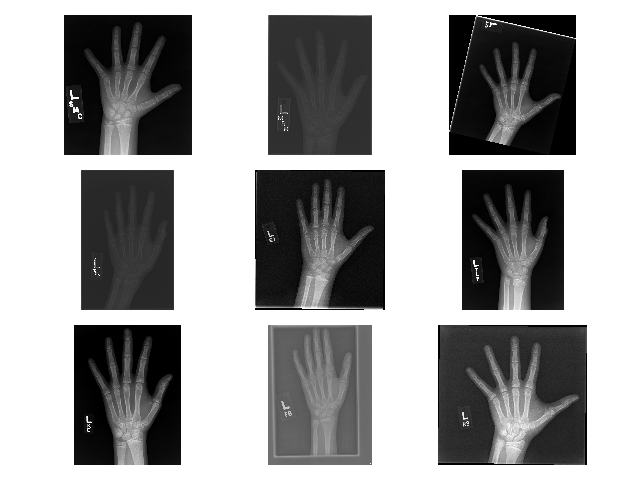
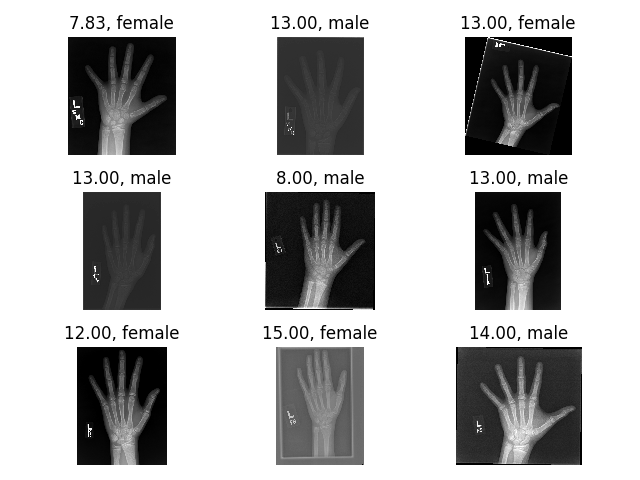
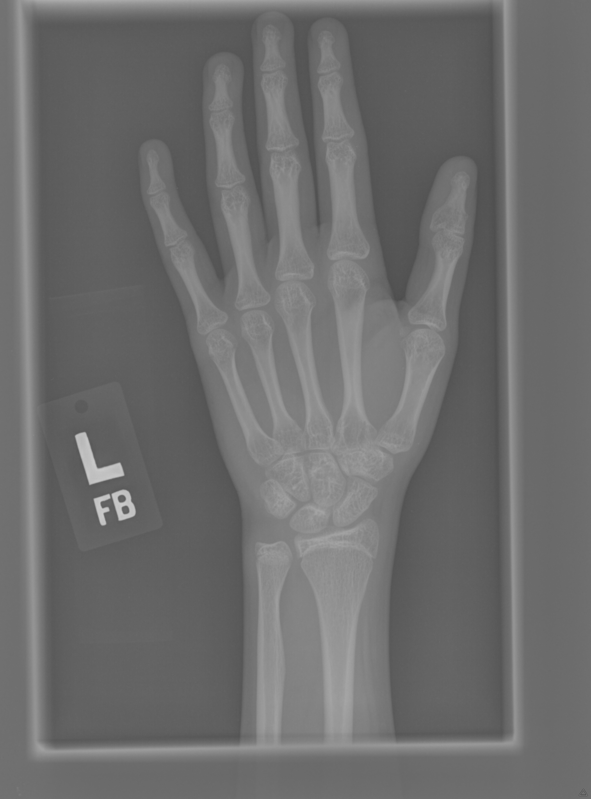

```{r setup, include=FALSE}
knitr::opts_chunk$set(echo = FALSE, warning = FALSE, message = FALSE)
knitr::opts_knit$set(root.dir = "/Users/luischavesrodriguez/OneDrive\ -\ Imperial\ College\ London/MScHDA/Term2/ML/ML-HandtoAge")
library(ggplot2)
library(tidyverse)
library(scales)
library(ggpubr)
```

# Project description
## Data
__Data source:__ Radiology Society of North America(RSNA) and Radiology Informatics Committee (RIC). Available in Kaggle. Images gathered by several 

__Dataset:__ 12,621 images of individuals aged between 1 month and 19 years (228 months) old. Gender and age available for all fo them.

__Context:__ Images gathered for the Pediatric Bone Age ML Challenge.

## Aim(s) of my study

> __Supervised question \#1:__ How close can we estimate age from images only?

> __Supervised question \#2:__ Can gender be derived from the image?

> __Unsupervised question:__ Can clustering algorithm accurately group together individuals by gender

## Population statistics
```{r}
info = read.csv("boneage-training-dataset.csv")
dens.per.sex = info %>% ggplot(aes(boneage, fill = male))+geom_density(alpha = 0.7)+scale_fill_brewer(palette = "Accent", name = "Gender", labels = c("Female", "Male"))+theme_minimal()+ggtitle("Age distribution by gender")+ylab("Density")+xlab("Age (in months)")+theme(text=element_text(size=21))


blank_theme = theme_minimal()+theme(
  axis.title.x = element_blank(),
  axis.title.y = element_blank(),
  panel.border = element_blank(),
  panel.grid=element_blank(),
  axis.ticks = element_blank(),
  plot.title=element_text(size=8, face="bold")
  )

pie = info %>% group_by(male) %>% 
  summarise(Proportion = n()/nrow(info)) %>% 
  ggplot(aes(x="", y=Proportion, fill=male))+
  geom_bar(width = 1, stat = "identity", show.legend = F)+coord_polar("y", start = 0)+
  geom_text(aes(y = Proportion/2 +
                  c(0, cumsum(Proportion)[-length(Proportion)]), 
                label = percent((1-Proportion)/100)), size=9)+blank_theme+theme(axis.text.x=element_blank())+scale_fill_brewer(palette = "Accent", name = "Gender", labels = c("Female", "Male"))

dens.per.sex+annotation_custom(ggplotGrob(pie), xmin = -150, ymin = 0.005)


```

## The images
X-ray images of each individuals' hand (one or two - information not available)

* Difficulties:  
    + Varying resolution (plot)  
    + Varying contrast  
    + Varying exposure
    + Some scanned and some digital images  
    
* Advantages:  
    + Standardised medical images 

Let's have a look at some pictures!

## Raw Images



## Raw Images



# Methods: Deep Learning for Computer Vision

## Data processing 
### Data split
10,000 Images for training, 2611 for testing/validation, no cross-validation because of computational cost and large amount of training data.

### Image processing
* Rescaled and Center Cropped Images:
* Centering and scaling features (pixel values)
* Contrast adjustment

## Image processing & Feature engineering (1/3)

Large disparity in image resolution therefore need to make all images same size. Default for many network architectures is 224x224 so that is our choice! Could be increased for likely better results at higher computational cost


## Image processing & Feature engineering (2/3)

It is widely recommended to normalise the inputs of a neural networks as this will speed up training by gradient descent. 
Several forms of normalisation: Instance Normalisation(IN) and Batch Normalisation(BN):

* IN: Center and scale each image w.r.t. its mean and standard deviation.
* BN: Center and scale each image w.r.t. the whole batch of images mean and standard deviation

> The (instance) normalization process allows to remove instance-specific contrast information from the content image [see @Smith2015]

## Image processing & Feature engineering

{width=70%}{width=30%}

## Image processing & Feature engineering

{width=70%}{width=30%}


## Network of choice: ResNet

## Hyperparameter tuning

* Learning rate $\alpha$
* Optimizer: __SGD__, Adam
* Learning rate scheduler: StepLR, Exponential LR, ReduceONPlateauLR, __CyclicLR__, __OneCycle Policy__
* Image normalisation: batch vs instance
* Networks' depth (\# of layers): 18, 34 and 50 layer-deep ResNets
* Regularisation: L2-regularisation

## Exponentially growing possibilites

The 'Caviar' approach: training many many models with different hyperparameters, seeing which one does best. I tried:

* Varying ResNet Depth: 18, 34, 50 layers.
    + IN, $\alpha$ = 1,ExponentialLR schedule, $\gamma$ = 0.7, ADAM optimizer, no weight decay
* Changing LR schedule: ReduceOnPlateau, StepLR with different $\gamma$ (0.1 and 0.5) and stepsize (1,4,9,16,25).
* __Moving into smarter ideas:__ CyclicLR, LR Range finder and One cycle policy.


## Results 1, varying depth

```{r}
res18 = read_csv('Results/TrainTestLoss1.csv')
res34 = read_csv('Results/TrainTestLoss2.csv')
res50 = read_csv('Results/TrainTestLoss3.csv')

pBatch18 = read_csv('Results/LossPBatch1.csv')
pBatch34 = read_csv('Results/LossPBatch2.csv')
pBatch50 = read_csv('Results/LossPBatch3.csv')

res18$X1 = res34$X1 = res50$X1 = res18$X1+1
colnames(res18)[1] = colnames(res34)[1] = colnames(res50)[1] = "Epoch"

results = rbind(cbind(res18, Depth = "18"),
                cbind(res34, Depth = "34"),
                cbind(res50, Depth = "50"))

LastTest = results %>% group_by(Depth) %>% summarise(LastValue = last(`Test loss`))
LastTrain = results %>% group_by(Depth) %>% summarise(LastValue = last(`Train loss`))

results %>% pivot_longer(-c(Epoch, Depth), names_to = "Loss", values_to = "MAE") %>%
  ggplot(aes(x = Epoch, y = MAE, color = Depth))+
  geom_line(aes(linetype = Loss))+facet_wrap(~Depth)+
  ylim(0,60)+theme_pubclean()+
  scale_color_brewer(palette = "Paired")+
  ggtitle("Training curves for different ResNet depths and an exponential LR schedule")+
  geom_text(data = LastTest, aes(x=-Inf, y = -Inf, label=round(LastValue,2)),
            hjust= -1, vjust = -1, show.legend = F, fontface=2)+
  geom_text(data = LastTrain, aes(x=-Inf, y = -Inf, label=round(LastValue,2)),
            hjust= -1, vjust = -1, show.legend = F,fontface = 1, size = 10)+
  theme(text=element_text(size=21))


```

## Results 2, varying LR scheduler

```{r}
## Step LR
# formsart SLR(StepLR).SS(StepSize).gamma(div factor)
SLR.1.05 = read.csv("Results/05stepLRTrainTestLoss1.csv")
SLR.4.05 = read.csv("Results/05stepLRTrainTestLoss4.csv")
SLR.9.05 = read.csv("Results/05stepLRTrainTestLoss9.csv")
SLR.16.05 = read.csv("Results/05stepLRTrainTestLoss16.csv")
SLR.25.05 = read.csv("Results/05stepLRTrainTestLoss25.csv")


SLR.1.05$X = SLR.16.05$X = SLR.25.05$X = SLR.4.05$X = SLR.9.05$X = SLR.1.05$X+1

colnames(SLR.1.05)[1] = colnames(SLR.4.05)[1] = colnames(SLR.9.05)[1] = colnames(SLR.16.05)[1] = colnames(SLR.25.05)[1] = "Epoch"

res = rbind(cbind(SLR.1.05, StepSize = "1"),
            cbind(SLR.4.05, StepSize = "4"),
            cbind(SLR.9.05, StepSize = "9"),
            cbind(SLR.16.05, StepSize = "16"),
            cbind(SLR.25.05, StepSize = "25"))
LastTestg1 = res %>% group_by(StepSize) %>% summarise(LastValue = last(Test.loss))
LastTraing1 = res %>% group_by(StepSize) %>% summarise(LastValue = last(Train.loss))

g1 = res %>% pivot_longer(-c(Epoch, StepSize), names_to = "Loss", values_to = "MAE") %>%
  ggplot(aes(x = Epoch, y= MAE, color = StepSize))+geom_line(aes(linetype = Loss))+
  facet_wrap(~StepSize)+theme_pubclean()+scale_color_brewer(palette = "Paired")+
  geom_text(data = LastTestg1, aes(x=-Inf, y = -Inf, label=round(LastValue,2)),
            hjust= -4, vjust = -10, show.legend = F, fontface = 2)+
  geom_text(data = LastTraing1, aes(x=-Inf, y = -Inf, label=round(LastValue,2)),
            hjust= -4, vjust = -6, show.legend = F, fontface = 1)


g2 = res %>% group_by(StepSize) %>% summarise(MinTrain = min(Train.loss), MinTest = min(Test.loss)) %>%
  pivot_longer(-StepSize, names_to = "Loss", values_to = "Min.MAE") %>%
  ggplot(aes(x = StepSize, y= Min.MAE, color = Loss, group = Loss))+geom_line()+
  geom_point(aes(x = StepSize, y = Min.MAE, color = Loss))+scale_color_brewer(palette = "Paired")+
  theme_pubclean()


g1

```


## Exploring the bias-variance tradoff
```{r}
g2+ggtitle("Minimum MAE against hyperparameter value choice")+theme_pubclean()+scale_color_brewer(palette = "Paired")
```

## Instead of fixed learning rate changes, reduce on pleateau

Goign for a slightly smarter choice 
```{r}
redOnP = read.csv("Results/RedOnPlateauTrainTestLoss1.csv")

redOnP$X = redOnP$X+1
colnames(redOnP)[1] = "Epoch"

LastTest = redOnP %>% summarise(LastValue = last(Test.loss))
LastTrain = redOnP %>% summarise(LastValue = last(Train.loss))

redOnP %>% pivot_longer(-c(Epoch), names_to = "Loss", values_to = "MAE") %>%
  ggplot(aes(x = Epoch, y = MAE))+
  geom_path(aes(linetype = Loss))+
  ylim(0,60)+theme_minimal()+
  scale_color_brewer(palette = "Paired")+
  ggtitle("Training curves with a 'Reduce On Plateau' LR schedule")+
  geom_text(data = LastTest, aes(x=-Inf, y = -Inf, label=round(LastValue,2)), hjust= -12, vjust = -20, show.legend = F)+
  geom_text(data = LastTrain, aes(x=-Inf, y = -Inf, label=round(LastValue,2)), hjust= -16, vjust = -16, show.legend = F,
            fontface = 2)


```


## Challenging conventional wisdom
### Cyclic Learning Rates and One-Cycle Policy
Leslie Smith challenged conventional wisdon on deep learning optimisation when he presented his work on Cyclic Learning Rates and the One cycle policy, as well as a method to efficiently find a reasonable learning rate for an application (LR range test) (See @Smith2015, @Smith2017 and @Smith2018)

* LR range test:
During one (or a few) epochs, we train a given network with increasing(lineraly or exponentially) LR $\alpha$ for each training iteration (i.e for each batch). We record the loss until $\alpha$ is too big and the loss starts diverging and we obtain such a curve. 

Then we choose an $\alpha$ one order of magnitude below the minimum, to be safe away from divergence, for the upper bound. The lower bound can be set to $\frac{1}{3}$ or $\frac{1}{4}$ of the upper bound.

## Challenging conventional wisdom
### Cyclic Learning Rates and One-Cycle Policy
Leslie Smith challenged conventional wisdon on deep learning optimisation when he presented his work on Cyclic Learning Rates and the One cycle policy, as well as a method to efficiently find a reasonable learning rate for an application (LR range test) (See @Smith2015, @Smith2017 and @Smith2018)

* CLR: 
Learning rate oscillates between two bounds as found by the LR Range test


## Challenging conventional wisdom
### Cyclic Learning Rates and One-Cycle Policy
Leslie Smith challenged conventional wisdon on deep learning optimisation when he presented his work on Cyclic Learning Rates and the One cycle policy, as well as a method to efficiently find a reasonable learning rate for an application (LR range test) (See @Smith2015, @Smith2017 and @Smith2018)

* OneCycle policy: 
Modification of the CLR method where there is only a single cycle with $\alpha$ decreasing further than the lower bound in the last iterations. This algorithm has been shown to reach scores as good or better than very fine-tuned networks in many less training iterations
 

## My results with the previously mentioned methods

LR finder:

```{r}
optimLR = read.csv("Results/OptimLR.csv")

minor_breaks <- rep(1:9, 21)*(10^rep(-10:10, each=9))

optimLR$lr = 10^(optimLR$lr)
chosenPoint.low = which.min((optimLR$lr-3*10^-2)^2)
chosenPoint.max = which.min((optimLR$lr-2*10^-1)^2)


optimLR[30:nrow(optimLR),] %>% ggplot(aes(x = lr, y = loss))+geom_line()+
    #geom_point(data = optimLR[c(chosenPoint.low, chosenPoint.max),], aes(x = lr, y = loss))+
  scale_x_log10(breaks = trans_breaks("log10", function(x) 10^x),
              labels = trans_format("log10", math_format(10^.x)),
              minor_breaks = minor_breaks)+
  annotation_logticks(sides="b")+theme_bw()+
  ggtitle("LR 'calibration' curve for Resnet18")+
  geom_vline(data = data.frame(x = c(5*10^-2, 2*10^-1)), aes(xintercept = x), linetype = 2)


```
## My results with the previously mentioned methods

```{r}
CLRrun = read.csv("Results/CLRTrainTestLoss1.csv")

CLRrun$X = CLRrun$X+1
colnames(CLRrun)[1] = "Epoch"

LastTest = CLRrun %>% summarise(LastValue = last(Test.loss))
LastTrain = CLRrun %>% summarise(LastValue = last(Train.loss))

CLRrun %>% pivot_longer(-c(Epoch), names_to = "Loss", values_to = "MAE") %>%
  ggplot(aes(x = Epoch, y = MAE))+
  geom_path(aes(linetype = Loss))+
  ylim(0,60)+theme_minimal()+
  scale_color_brewer(palette = "Paired")+
  ggtitle("Training curves with a 'Reduce On Plateau' LR schedule")+
  geom_text(data = LastTest, aes(x=-Inf, y = -Inf, label=round(LastValue,2)), hjust= -12, vjust = -20, show.legend = F, fontface = 2)+
  geom_text(data = LastTrain, aes(x=-Inf, y = -Inf, label=round(LastValue,2)), hjust= -16, vjust = -16, show.legend = F,
            fontface = 1)
```

## Incorporating CHALE and the OneCycle policy
Incroproating CHALE for shaper images as well as regularisation L2 norm and OneCyclePolicy
```{r}
CHALEOptiLR0 = read.csv("Results/0CHALEOptLR.csv") # no regularisation
CHALEOptiLR01 = read.csv("Results/01CHALEOptLR.csv")
CHALEOptiLR001 = read.csv("Results/001CHALEOptLR.csv")
CHALEOptiLR0001 = read.csv("Results/0001CHALEOptLR.csv")
CHALEOptiLR00001 = read.csv("Results/00001CHALEOptLR.csv")


minIter = 30
len = nrow(CHALEOptiLR0)
optiRes = rbind(cbind(CHALEOptiLR0[minIter:len,-1], Lambda = 0),
                cbind(CHALEOptiLR01[minIter:len,-1], Lambda = 0.1),
                cbind(CHALEOptiLR001[minIter:len,-1], Lambda = 0.01),
                cbind(CHALEOptiLR0001[minIter:len,-1], Lambda = 0.001),
                cbind(CHALEOptiLR00001[minIter:len,-1], Lambda = 0.0001))

optiRes$lr = 10^(optiRes$lr)
optiRes$Lambda = as.factor(optiRes$Lambda)

optiRes %>% ggplot(aes(x = lr, y = loss, color = Lambda))+
  geom_line()+
  scale_x_log10(breaks = trans_breaks("log10", function(x) 10^x),
              labels = trans_format("log10", math_format(10^.x)),
              minor_breaks = minor_breaks)+
  annotation_logticks(sides="b")+theme_minimal()+
  scale_color_brewer(palette = "Paired")

# max = 2*10^-1

```

## Incorporating CHALE and the OneCycle policy
Incroproating CHALE for shaper images as well as regularisation L2 norm and OneCyclePolicy
```{r}
optiRes %>% filter(Lambda == 0.001) %>% ggplot(aes(x = lr, y = loss, color = Lambda))+
  geom_line()+
  scale_x_log10(breaks = trans_breaks("log10", function(x) 10^x),
              labels = trans_format("log10", math_format(10^.x)),
              minor_breaks = minor_breaks)+
  annotation_logticks(sides="b")+theme_minimal()+
  scale_color_brewer(palette = "Paired")
```

## Results from 1-Cycle Policy with CHALE

...A work in progress?
```{r}

```


# Unsupervised Learning
## Unsupervised learning for clustering by gender
## Unsupervised learning for image compression 
## Unsupervised learning for image segmentation (proof of concept)

# Limitations and further work

* Turning regression problem into classification by binning individuals into age groups
* Trying different neural net architectures, especially simpler ones
* Deep learning clustering methods such as VAE and t-SNE
* 

# Results
